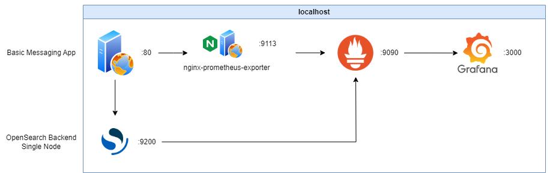

# Simple Chat Web App Infrastructure

## Overview

This project is a simple chat web application that allows users to send and view messages in real-time. It is built using a combination of Nginx, OpenSearch, Prometheus, and Grafana for monitoring. The application is containerized using Docker and orchestrated with Docker Compose.



## Features

- Real-time message sending and receiving
- User-friendly interface
- Monitoring with Prometheus and Grafana
- Secure password management for OpenSearch

## Prerequisites

- Docker
- Docker Compose

## Setup

1. **Clone the repository:**

   ```bash
   git clone https://github.com/c-adrien/simple-chat-web-app-infrastructure.git
   cd simple-chat-web-app-infrastructure
   ```

2. **Set environment variables:**

   Ensure you have the following environment variables set in your shell or in a `.env` file:

   ```bash
   export DOCKERHUB_USERNAME=your_dockerhub_username
   export OPENSEARCH_PASSWORD=$(echo -n "your_opensearch_password" | base64)
   export GF_SECURITY_ADMIN_PASSWORD=your_grafana_admin_password
   ```

3. **Run the setup script:**

   ```bash
   ./setup.sh
   ```

   This script will build and start the Docker containers, set up OpenSearch, and install necessary plugins.

## Usage

- Access the web application at `http://localhost`.
- Use the form to send messages and view them in the timeline.
- Access Grafana for monitoring at `http://localhost:3000` (default admin password is set via environment variable).

## Monitoring

- **Prometheus** is available at `http://localhost:9090`.
- **Grafana** dashboards can be accessed at `http://localhost:3000`.

## Deployment

To publish the Docker image to Docker Hub, use the `publish-app-image.sh` script:

```bash
./publish-app-image.sh
```

## Configuration

- **Nginx** configuration is located in `app/nginx.conf`.
- **Prometheus** configuration is located in `monitoring/prometheus.yml`.
- **Grafana** provisioning files are located in `monitoring/grafana/provisioning`.

## Security

- Ensure that all passwords and sensitive information are stored securely and not hardcoded in the codebase.
- Use environment variables to manage sensitive data.

## Contributing

Contributions are welcome! Please fork the repository and submit a pull request for any improvements or bug fixes.

## License

This project is licensed under the MIT License.
